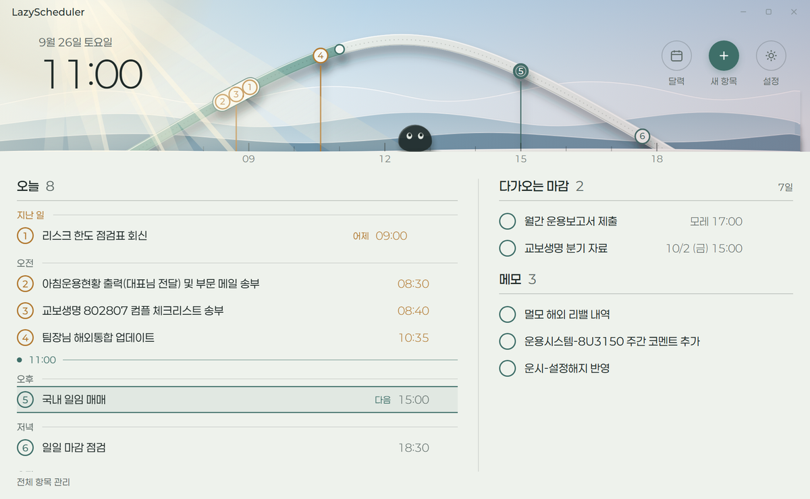

# LazyScheduler

For people whose work is mostly recurring: it keeps track of routine tasks that
land on business days rather than plain calendar dates — the second business day
of the month, the last Thursday, three business days before month end — and
quietly shifts anything that falls on a weekend or a Korean public holiday.
Alongside those you can drop in one-off deadlines and loose notes with no date at
all. Close the window and it keeps running in the background, sliding a soft
notification card into the corner of the screen a little before something is due,
so the whole thing stays out of your way until it actually has something to say.



Adding a routine — pick how often, pick the rule, and it shows you the next five
dates before you commit.

There are two apps: a **Windows desktop app** (Python, a WebView2 window) and an
**Android app** (Kotlin, Compose). Sign in with Google and they show the same
items, settings and completions; both keep working offline and send their changes
up when a connection comes back. Reminders fire on each device on its own, so the
phone does not need the PC. Sync is optional — without signing in, the desktop app
is exactly what it was, and everything stays on your machine.

The design, including how edits from two devices are merged, is in
[docs/sync.md](docs/sync.md).

## Layout

```
main.py          entry point (--ui opens the window, --selftest checks a build)

  core — no Windows here; a phone app reuses these rules and this data format
store.py         reading/writing data.json, backups, revision, the client payloads
recur.py         recurrence rules, business days, Korean holidays
syncdoc.py       how an item looks in the cloud, and which fields changed (docs/sync.md)
tokens.py        colours, weights, metrics — the one place they are defined

  desktop — Windows only
app.py           HTTP API (see "API contract"), scheduler, notification decisions
ui.py            the native WebView2 window process
toast.py         the notification cards (drawn with Pillow)
tray.py          tray icon, badge, menu
autostart.py     "run at login" and the desktop shortcut
win32.py         shared Win32 structures (monitors), DPAPI for the saved sign-in
cloudauth.py     Google sign-in on the PC → Firebase session (docs/sync.md §6)
cloudsync.py     sends the outbox to Firestore and pulls changes (docs/sync.md §5)
ipc.py           how the service and the window process reach each other
paths.py         where every file lives (resources vs. user data)

assets/          things the app ships with: app.ico, fonts/Paperlogy-*.ttf
web/             the window itself: index.html, app.js (lists · calendar · forms), sky.js (sun · light · orbit),
                 pebble.js (the pebble's behaviour), style.css, fonts/*.woff2
tools/           things you run while developing (see below)
tests/           pytest; tests/vectors holds the recurrence cases (shared with the phone app)
docs/            screenshots for this file; sync.md is the PC ↔ phone sync design
firebase/        Firestore security rules and config (deploy with the Firebase CLI)
android/         the Android app (Kotlin, Compose, Firestore SDK)
```

Your own schedule never lives here — it is in `%APPDATA%\LazyScheduler\`.

## API contract

The window talks to the service only through the HTTP API, and any other client
(a phone app) should do the same.

- `GET /api/ping` → `{api, schema}`. `api` goes up only on a breaking change
  (a field removed or its meaning changed); adding fields is not breaking.
- `GET /api/overview` → today's view. Items in `tasks` carry only
  `store.PUBLIC_TASK_FIELDS`; storage-only fields such as `done_dates` stay on disk.
- `GET /api/occurrences?from=YYYY-MM-DD&to=YYYY-MM-DD[&kind=routine,...]` →
  `{rev, items: [{id, date, time, done}]}`. Join with overview items by `id`.
- `rev` is a fingerprint of `data.json`. It changes whenever the data changes and
  only then, so a client can keep what it fetched until `rev` moves.
- Requests that change items or settings (`POST /api/task…`, `POST /api/settings`)
  accept `?ov=1`; the reply then also carries `overview`, the same body as
  `GET /api/overview` after the change, so a client doesn't have to ask again.

## Development

```
python -m pytest                  run the tests
python tools/build.py             build release/LazyScheduler(.zip)
python tools/gen_tokens.py        rewrite the :root block in web/style.css
python tools/build_fonts.py       assets/fonts/*.ttf  ->  web/fonts/*.woff2
python tools/gen_icon.py          redraw assets/app.ico and web/icon*.png
```

`gen_tokens.py` and `build_fonts.py` both take `--check`, which exits non-zero
when the generated files are out of date; the test suite runs them that way.
